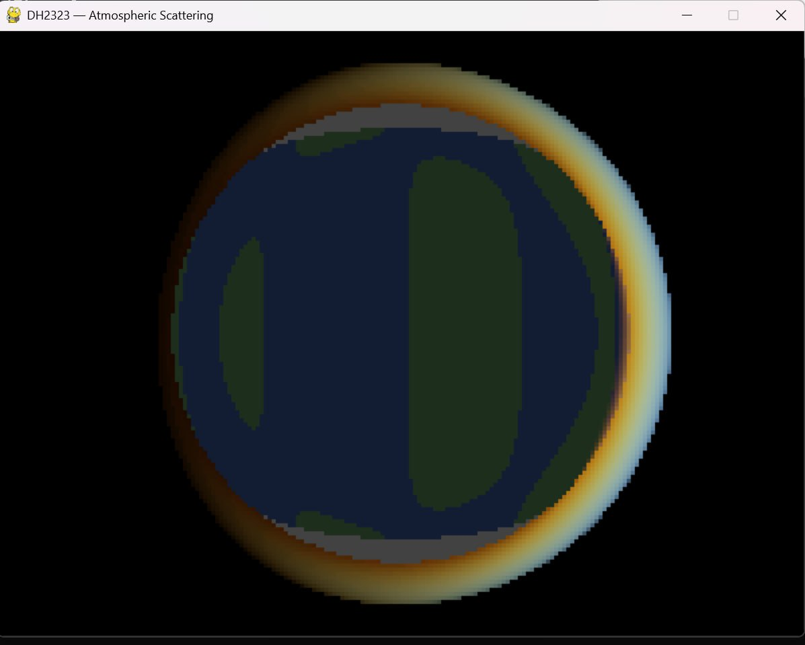
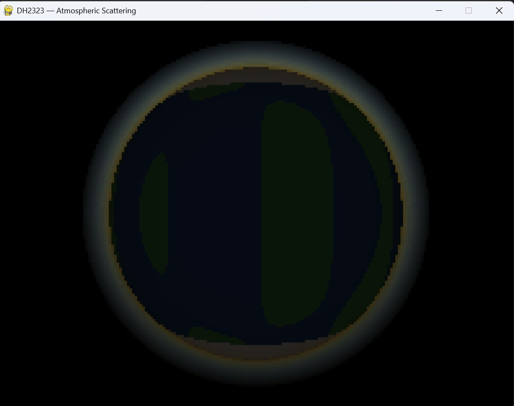
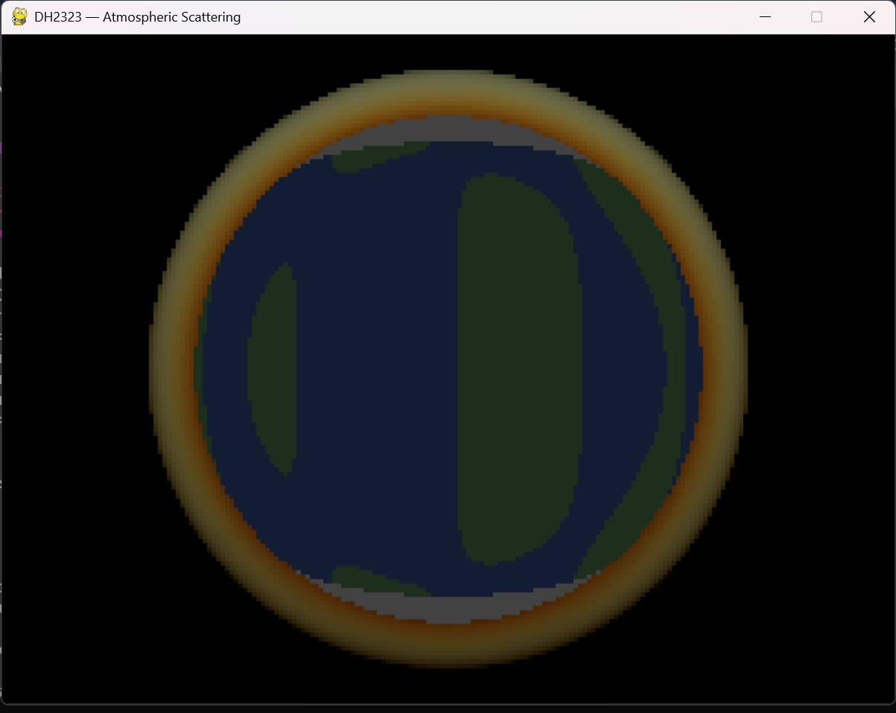
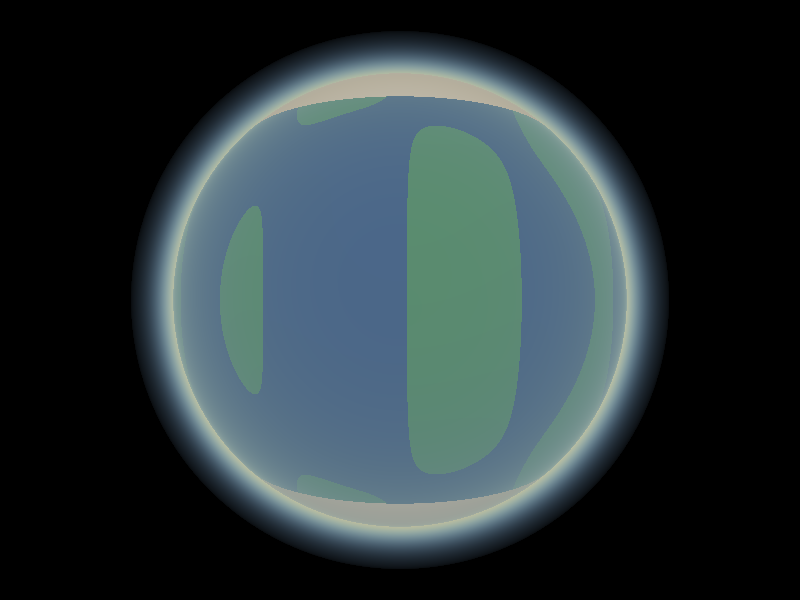
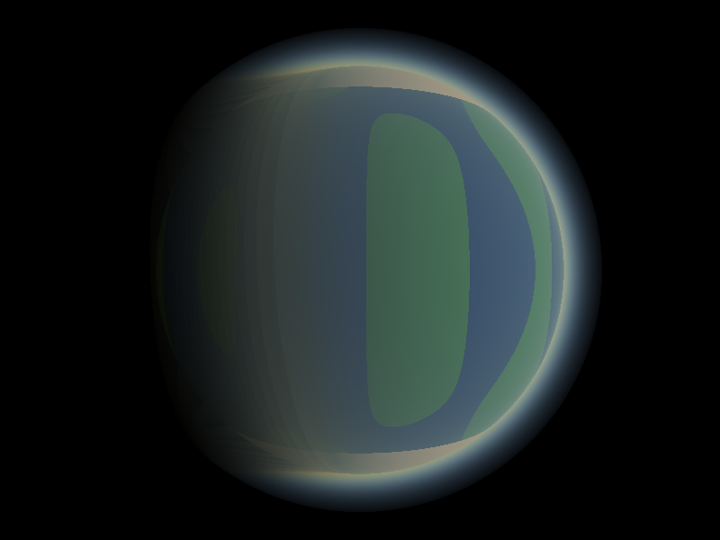
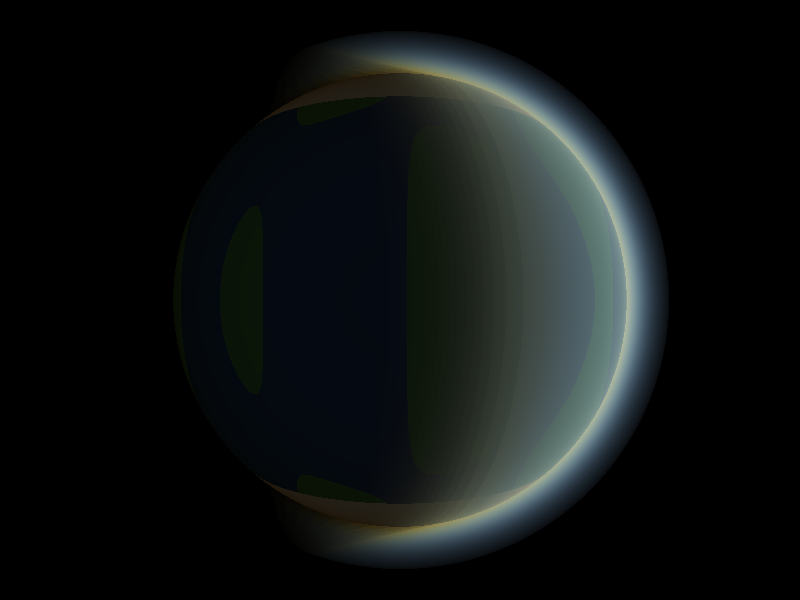
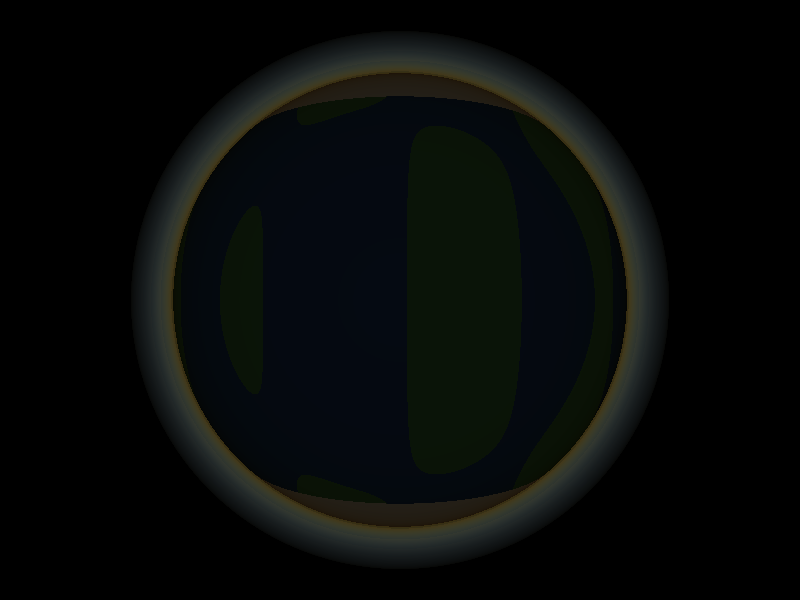

# DH2323 Project Blog — Atmospheric Scattering Planet Renderer
 
**Course:** DH2323 Computer Graphics and Interaction, KTH Royal Institute of Technology  
**Group members:** Ma Jinlin and Rajadharshini Nedumaran  
**Target grade:** B  
 
Welcome to our project blog! We are two exchange students at KTH building 
a planet renderer from scratch in Python that simulates how sunlight 
scatters through a planetary atmosphere. Think of it as recreating 
what Earth looks like from space, with a glowing blue halo and 
orange-red sunsets, all computed mathematically without any game engine 
or GPU.
 
We will be updating this blog as we go, so check back for progress 
updates, screenshots, and notes on what we learned along the way.
 
---
 
## 1 May 2026
 
We officially kicked off the project today! After going back and forth 
on a few ideas, we settled on atmospheric scattering because it has a 
strong academic paper behind it (Nishita et al., SIGGRAPH 1993) and 
the visual results are genuinely beautiful. It felt like something we 
would actually enjoy working on rather than just getting through.
 
Today was mostly setup. We got the GitHub repository going, wrote our 
project specification, and submitted it on Canvas. Ma Jinlin is taking 
on the core rendering pipeline and Rajadharshini will handle the 
scattering colours, surface improvements, and report writing.
 
**What we got done:**
- GitHub repository created and blog set up
- Project specification submitted on Canvas
- Python environment ready with numpy, pygame and matplotlib
  
---
 
### 3 May 2026
 
Ma Jinlin started on the actual code today. The first thing to build 
was the camera system. For every single pixel on screen, the renderer 
needs to figure out which direction a ray should travel from the camera 
into the scene. Getting this right is important because everything else 
depends on it.
 
The ray-sphere intersection function was also written today. This is 
the maths that figures out exactly where a ray hits the planet surface 
or the atmosphere shell. It is essentially solving a quadratic equation, 
which sounds simple but took a bit of careful implementation to get 
right especially handling the edge cases.
 
**Files done:**
- camera.py
- Ray-sphere intersection inside atmosphere.py
  
---
 
## 5 May 2026
 
Today was the big one. The ray marching loop was implemented, which is 
the heart of the entire renderer. The idea is that instead of computing 
light analytically, you step along each ray in small increments and 
at each step you ask how much sunlight is scattering towards the camera 
from that point in the atmosphere.
 
The atmospheric density function was also completed. This models how 
the atmosphere gets thinner with altitude using an exponential falloff, 
which matches the physical reality pretty closely.
 
The planet surface shading was also added today, including the 
land, ocean and snow cap colours. Seeing the planet look like an 
actual Earth for the first time was a nice moment.
 
**Files done:**
- atmosphere.py fully completed
- planet.py completed
  
---
 
## 7 May 2026
 
First visual output today! The planet rendered for the first time with 
the atmosphere visible. It was pixelated at this stage since we were 
running at low resolution for speed, but you could clearly see the 
blue ocean, green land, white snow caps at the poles, and a blue 
atmospheric glow around the edges.
 
The pygame interactive window was also completed, so you can now 
rotate the camera around the planet using the arrow keys. Pressing R 
saves a high resolution version to disk.
 
<!-- INSERT FIRST RENDER SCREENSHOT HERE -->
<!-- Save your image to the screenshots folder and replace the filename below -->

 
One issue spotted today was that the atmospheric glow was uniform all 
around the planet regardless of where the sun was pointing. That was 
going to be the next thing to fix.
 
---
 
## 8 May 2026
 
Fixed the atmosphere bug from yesterday. The glow was not responding 
to the sun direction at all, so the planet looked equally bright 
all around which is not realistic.
 
The fix was to compute a sun-facing factor at each step of the ray 
march, using the dot product of the outward surface normal with the 
sun direction. This way, points on the dark side of the planet 
contribute very little to the glow and the bright halo only appears 
on the side facing the sun.
 
After the fix the planet looks much more like how Earth actually 
appears from the ISS, with a clear lit hemisphere and a dark night 
side. We were pretty happy with how it turned out.
 
<!-- INSERT BEFORE AND AFTER SCREENSHOTS HERE -->

 
The core renderer is now done and pushed to GitHub for Rajadharshini 
to pick up from here.
 
---
 
## 10 May 2026
 
Rajadharshini pulled the code from GitHub and started working on 
improving the scattering colours. The Rayleigh scattering coefficients 
were tuned carefully based on the physical wavelengths of red, green 
and blue light. Blue scatters about 5.5 times more than red, which 
is exactly what makes the sky blue and sunsets orange in real life.
 
The sun direction presets were also improved to get more dramatic 
colour shifts between the different views. The sunset preset now 
shows a clear warm orange tint on the atmospheric limb which looks 
much more convincing.
 
<!-- INSERT RAYLEIGH COLOURS SCREENSHOT HERE -->

 
---
 
## 11 May 2026
 
With the base colours working, we experimented with the atmosphere 
shell thickness by varying the scale height parameter. This controls 
how quickly the atmosphere thins out with altitude, and the visual 
difference is dramatic.
 
A very small scale height gives the planet a razor thin sharp halo 
sitting tightly around the surface. A large value creates a wide, 
soft glow that almost swallows the planet entirely. Getting this 
value right was important because too thin looks unrealistic and 
too thick obscures the surface detail underneath.
 
<!-- INSERT SCALE HEIGHT COMPARISON SCREENSHOTS HERE -->

 
---
 
## 12 May 2026
 
Today we implemented Mie scattering as an extension on top of the 
existing Rayleigh scattering. While Rayleigh accounts for the blue 
sky colour from air molecules, Mie scattering deals with larger 
particles like dust and water droplets. We used the Henyey-Greenstein 
phase function to model how strongly it directs light forward towards 
the viewer, producing the bright halo effect you typically see around 
the sun near the horizon.
 
After testing both versions side by side we actually decided to go 
with the version without Mie scattering for our final result. The 
Mie version produced a halo that was noticeably too bright and too 
large, making the planet look overexposed around the limb. The 
Rayleigh-only version looked cleaner and more physically convincing 
for a planet viewed from outer space.
 
The two demo videos below show the planet rotating under each 
configuration so the difference is easy to compare.
 
<!-- INSERT DEMO VIDEOS HERE -->
<!-- Save your videos to the screenshots folder and replace the filenames below -->
[Demo without Mie scattering](screenshots/demo_no_mie.mp4)
[Demo with Mie scattering](screenshots/demo_with_mie.mp4)
 
---
 
## 14 May 2026
 
Report writing day. We split the sections between us and worked 
through it. One thing that surprised us was how much there was to 
say about the implementation once we sat down to write it. There 
were quite a few small decisions made along the way that were 
worth explaining properly.
 
Final high resolution renders were saved today across all four sun 
direction presets using the Rayleigh-only configuration. These are 
the definitive output images from the project.
 
<!-- INSERT FINAL HIGH RESOLUTION RENDERS HERE -->

 
---
 
## 15 May 2026
 
Final day. We packaged everything up, double checked all the files 
were in order, and submitted on Canvas. It was a good project to 
work on. Atmospheric scattering turned out to be more approachable 
than we expected and the visual results made the effort feel 
worthwhile.
 
Thanks for reading along!
 
---
 
## References
 
Nishita, T., Sirai, T., Tadamura, K., and Nakamae, E. (1993).
Display of the Earth taking into account atmospheric scattering.
Proceedings of SIGGRAPH 1993, ACM, pp. 175-182.
 
Preetham, A. J., Shirley, P., and Smits, B. (1999).
A practical analytic model for daylight.
Proceedings of SIGGRAPH 1999, ACM, pp. 91-100.
 
Bruneton, E., and Neyret, F. (2008).
Precomputed atmospheric scattering.
Computer Graphics Forum, 27(4), pp. 1079-1086.
 
Bucholtz, A. (1995).
Rayleigh-scattering calculations for the terrestrial atmosphere.
Applied Optics, 34(15), pp. 2765-2773.
 
