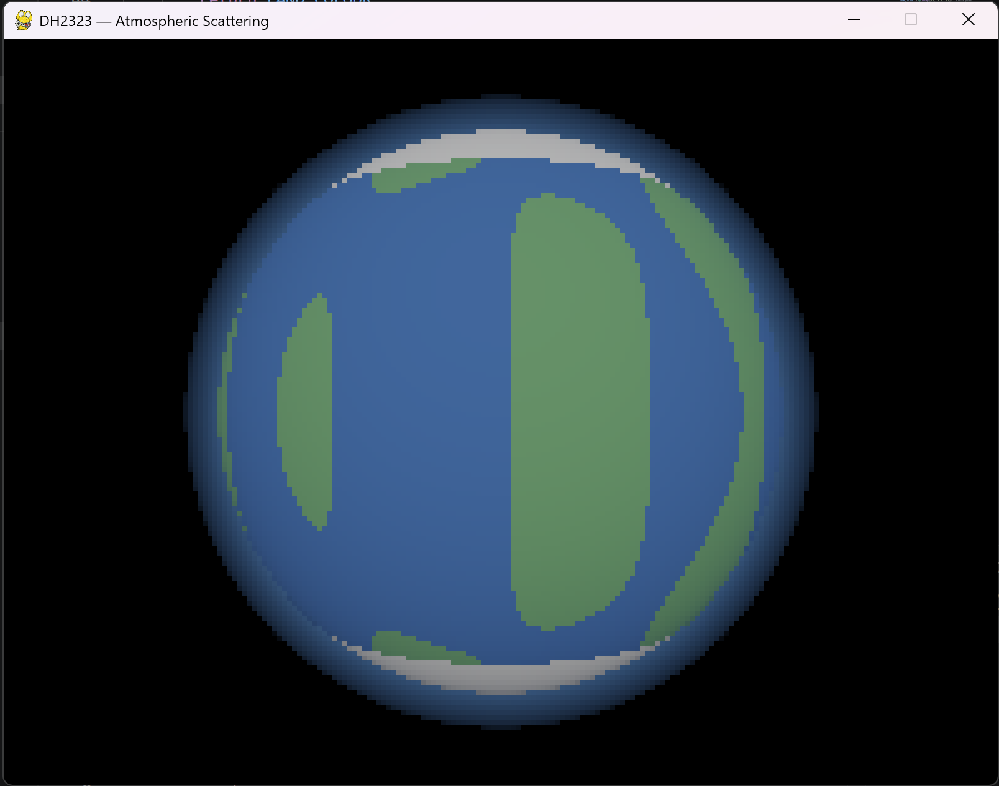
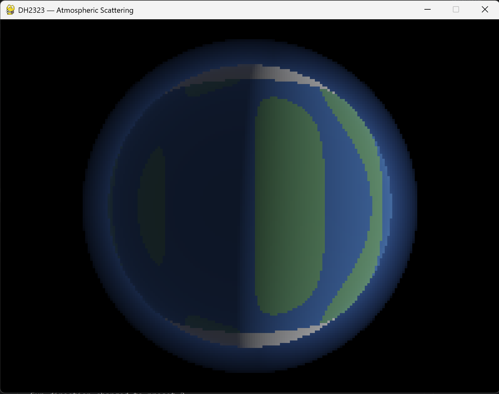

# DH2323 — Atmospheric Scattering: Interactive Planet Renderer

**Course:** DH2323 Computer Graphics and Interaction, KTH Royal Institute of Technology  
**Group:** Ma Jinlin and Rajadharshini Nedumaran  
**Target grade:** B  

---

## About This Project

We are implementing a CPU-based atmospheric scattering renderer in Python
that simulates how sunlight interacts with a planetary atmosphere as seen
from space. The visual output is a planet with a physically-based glowing
atmospheric halo — colours ranging from blue at noon to orange-red at the
day-night boundary — based on the SIGGRAPH paper by Nishita et al. (1993).

**Core CG techniques:** Ray casting, ray-sphere intersection, ray marching,
Rayleigh scattering, scalar field visualisation  
**Tools:** Python 3, numpy, pygame  
**Key reference:** Nishita, T. et al. (1993). SIGGRAPH.

---

## Progress Blog

---

### 1 May 2026 — Project Kickoff

Today we officially started the project. We decided on our topic after
reviewing several options — atmospheric scattering stood out because it
has a strong SIGGRAPH paper behind it (Nishita et al. 1993) and produces
visually impressive results without requiring a GPU.

We set up our GitHub repository, created the project structure, and wrote
our project specification which has been submitted on Canvas. Ma Jinlin
will handle the core rendering pipeline and Rajadharshini will handle
the visual layer, scattering colours, and report writing.

**Tasks completed today:**
- GitHub repository created and shared
- Project specification written and submitted on Canvas
- Blog set up on GitHub Pages
- Python environment set up with numpy, pygame, matplotlib

---

### 3 May 2026 — Core Renderer Started

Ma Jinlin began implementing the core files. Today the camera system and
ray direction computation were completed. For each pixel on screen, the
renderer now computes a ray direction from the camera position through
the image plane into the scene.

The ray-sphere intersection function was also completed — this solves
a quadratic equation to find exactly where each ray enters and exits
both the planet sphere and the atmosphere shell. This is the mathematical
foundation that everything else builds on.

**Files completed:**
- `camera.py` — camera position and per-pixel ray direction computation
- Ray-sphere intersection function inside `atmosphere.py`

---

### 5 May 2026 — Atmospheric Density and Ray Marching

The most important part of the renderer was implemented today — the ray
marching loop. This is what actually computes the colour of each pixel
by stepping along the ray through the atmosphere in small increments.
At each step, the code computes how much sunlight scatters towards the
camera using the atmospheric density function.

The density function models how the atmosphere gets thinner with altitude
using an exponential falloff — the same physical model described in
Nishita et al. 1993.

**Files completed:**
- `atmosphere.py` — density function, optical depth, full ray marching loop
- `planet.py` — planet surface diffuse shading and land/ocean/snow colours

---

### 7 May 2026 — First Visual Output

The renderer produced its first visual output today. The planet is visible
with ocean, land, and snow cap colours, and a blue atmospheric halo is
present around the edges.

<!-- INSERT SCREENSHOT HERE -->
<!-- To insert: save your screenshot to the screenshots folder,
     then replace the line below with the correct filename -->

The pygame interactive window was also completed today, allowing the camera
to orbit around the planet using arrow keys. At this stage the atmospheric
glow was uniform around the planet regardless of sun position — this was
identified as a bug to fix.

---

### 8 May 2026 — Atmosphere Bug Fix

An issue was identified where the atmospheric glow was not responding to
the sun direction — the halo appeared equally bright all around the planet
regardless of where the sun was. This was fixed by computing a sun-facing
factor at each ray march sample point using the dot product of the outward
surface normal with the sun direction vector.

After the fix, the atmosphere now correctly brightens on the sun-facing
side and fades on the night side, matching the appearance of real planetary
atmospheres seen from space.

<!-- INSERT BEFORE/AFTER SCREENSHOTS HERE -->

The core renderer is now complete and has been pushed to GitHub for
Rajadharshini to continue building on.

---

### 10 May 2026 — Rayleigh Scattering Colours (Rajadharshini)

Rajadharshini pulled the core renderer from GitHub and began working on
improving the scattering colour accuracy. The Rayleigh scattering
coefficients were tuned based on real physical wavelength values —
red at 700nm, green at 550nm, blue at 440nm — with blue scattering
approximately 5.5 times more than red following the 1/wavelength^4
relationship described in the Nishita paper.

<!-- INSERT SCREENSHOT OF IMPROVED COLOURS HERE -->

Sun direction presets were also improved to produce more dramatic
colour variations — the sunset preset now shows clear orange and red
tones at the atmospheric limb.

---

### 12 May 2026 — Mie Scattering Extension (Rajadharshini)

Mie scattering was added as an extension today. Unlike Rayleigh scattering
which affects all wavelengths proportionally, Mie scattering is caused by
larger atmospheric particles such as dust and water droplets. It produces
the bright white glow visible around the sun when seen from near the
horizon, and the hazy appearance of thick atmospheres.

The Henyey-Greenstein phase function was used to model the directional
nature of Mie scattering — light scatters strongly in the forward
direction (towards the viewer when looking at the sun).

<!-- INSERT MIE SCATTERING BEFORE/AFTER SCREENSHOTS HERE -->

---

### 13 May 2026 — Parameter Experiments

A series of parameter experiments were conducted to study how different
values affect the visual output. This forms the results section of our
final report.

**Scale height variation:**  
Changing the scale height controls how quickly the atmosphere thins with
altitude. A smaller value produces a sharp thin halo, while a larger
value produces a wide soft glow.

<!-- INSERT SCALE HEIGHT COMPARISON SCREENSHOTS -->

**Ray march step count variation:**  
Varying the number of ray march steps shows the quality versus performance
tradeoff. At 4 steps the image shows visible banding artefacts. At 16
steps the result is smooth and accurate. At 32 steps there is negligible
visual improvement but the render takes twice as long.

<!-- INSERT STEP COUNT COMPARISON SCREENSHOTS -->

---

### 14 May 2026 — Report Writing and Final Renders

Both group members worked on the project report today. Ma Jinlin wrote
the implementation section covering the technical details of the core
renderer. Rajadharshini wrote the introduction, related work, results,
and perceptual study sections.

Final high-resolution renders were saved for inclusion in the report.

<!-- INSERT FINAL HIGH RESOLUTION RENDER HERE -->

---

### 15 May 2026 — Demo Video and Submission

The demo video was recorded today. The video shows the interactive
renderer running with camera rotation, sun direction changes, and
the progression from a basic render to the final result with Mie
scattering enabled.

The project was packaged and submitted on Canvas including the full
source code, project report, project specification, and a link to
this blog.

<!-- INSERT LINK TO DEMO VIDEO HERE -->
**Demo video:** [Watch on YouTube]([insert YouTube link here])

---

## References

Nishita, T., Sirai, T., Tadamura, K., and Nakamae, E. (1993).
Display of the Earth taking into account atmospheric scattering.
*Proceedings of SIGGRAPH 1993*, ACM, pp. 175–182.

Preetham, A. J., Shirley, P., and Smits, B. (1999).
A practical analytic model for daylight.
*Proceedings of SIGGRAPH 1999*, ACM, pp. 91–100.

Bruneton, E., and Neyret, F. (2008).
Precomputed atmospheric scattering.
*Computer Graphics Forum*, 27(4), pp. 1079–1086.
